# cellify

A user-friendly command-line interface (CLI) tool designed for DFT researchers to quickly generate supercells and prepare calculation-ready inputs (VASP, Quantum ESPRESSO, etc.) from unit cells.

[](https://badge.fury.io/py/cellify)
[](https://pypi.org/project/cellify/)
[](https://opensource.org/licenses/MIT)
[](https://github.com/ToAmano/cellify/actions/workflows/tests.yml)
[](https://codecov.io/gh/ToAmano/cellify)

---

## Features

- **Format-Free Multi-Format Conversion**: Supports VASP (`POSCAR`, `CONTCAR`), Quantum ESPRESSO (`.in`, `.qe`), CIF (`.cif`), XSF (`.xsf`), XYZ (`.xyz`), and FHI-aims (`geometry.in`).
- **Flexible Cell Expansion (Supercell Generation)**:
  - Diagonal scaling (e.g., `2 2 2`).
  - Arbitrary $3 \times 3$ transformation matrices (e.g., for orthogonalization).
  - Minimum periodic image distance scaling (calculates the smallest cell to keep periodic images $\ge d\ \text{Å}$ apart).
- **Conventional Cell Auto-Conversion**: Automatically transforms loaded primitive structures into their standard conventional representation using `--conventional`.
- **Easy Defect & Doping Modeling**: Supports atomic substitutions (absolute index or percentage) and vacancy creation.
- **Surface Slab Generation**: Cuts surface slabs by specifying Miller indices $(h, k, l)$, slab thickness, and vacuum thickness.
- **Calculation-Ready Input Generation**: Automatically updates coordinate-dependent variables (e.g., `nat`, `ntyp` in Quantum ESPRESSO) while preserving all original calculation parameters, namelists, and comments.

---

## Installation

### 1. Install via PyPI
To install the latest stable release of `cellify` directly using pip:
```bash
pip install cellify
```

### 2. Local Installation (Development)
To install from the source code for development or customization:
```bash
git clone https://github.com/ToAmano/cellify.git
cd cellify
pip install -e .

# Or install with test dependencies
pip install -e ".[test]"
```

---

## CLI Usage

```bash
cellify -i <input_file> -o <output_file> [options]
```

### Arguments List
- `-i`, `--input` : Input structure file path (Required).
- `-o`, `--output` : Output structure file path (Default: `<input_base>_supercell.<ext>`).
- `-d`, `--dim` : Diagonal scaling factors. 3 integers separated by spaces (e.g., `--dim 2 2 2`).
- `-m`, `--matrix` : $3 \times 3$ transformation matrix. Specify row values separated by spaces, rows separated by slashes/commas/semicolons (e.g., `--matrix "1 -1 0 / 1 1 0 / 0 0 2"`).
- `--min-dist` : Automatically generate a supercell with minimum periodic image distance $\ge$ specified distance (in $\text{Å}$).
- `--conventional` : Automatically convert the input structure to its standard conventional representation before applying other operations.
- `--substitute` : Substitution rule. Format: `element:target_element:index_or_percentage` (e.g., `--substitute "Si:P:0"` or `--substitute "Si:Al:5%"`).
- `--vacancy-index` : Create a vacancy by removing an atom at a specific absolute index. Format: `element:index` (e.g., `--vacancy-index "Si:0"`, `--vacancy-index "C:33"`). (Alias: `--vacancy`).
- `--vacancy-count` : Create vacancies by randomly removing a specified number of atoms of a given element. Format: `element:count` (e.g., `--vacancy-count "O:2"`_).
- `--slab` : Miller indices $h\ k\ l$ for surface slab model creation (e.g., `--slab 1 1 1`).
- `--thick` : Slab thickness in $\text{Å}$ or layers (e.g., `--thick 15.0`).
- `--vacuum` : Vacuum layer thickness in $\text{Å}$ (e.g., `--vacuum 15.0`).
- `--template` : Template QE input file to preserve computational parameters and comments when generating a new input file from a QE output log file.
- `--calc`, `--calculation` : Override the `calculation` parameter inside the QE input file namelist (e.g., `scf`, `nscf`, `bands`).
- `-w`, `--view` : Quickly visualize the final generated structure in 3D using ASE (requires GUI environment). If `_tkinter` is missing, it automatically falls back to a 2D matplotlib projection plot.

> [!NOTE]
> **3D Visualization (Tkinter / `_tkinter` error)**
> If you run with `-w`/`--view` and see `ModuleNotFoundError: No module named '_tkinter'`, your Python environment is missing Tcl/Tk support:
> - **macOS (Homebrew Python)**: Run `brew install python-tk` (or `python-tk@3.9` matching your python version).
> - **macOS (Conda Python)**: Run `conda install -c conda-forge tk python` inside your active environment.
> - **Linux (Ubuntu/Debian)**: Run `sudo apt-get install python3-tk`.
>
> If Tkinter is not available, `cellify` automatically falls back to rendering a 2D projection window using `matplotlib`.

---

## Examples

### 1. Create a simple $2 \times 2 \times 3$ supercell (VASP POSCAR)
```bash
cellify -i POSCAR -o POSCAR_223 --dim 2 2 3
```

<p align="center">
  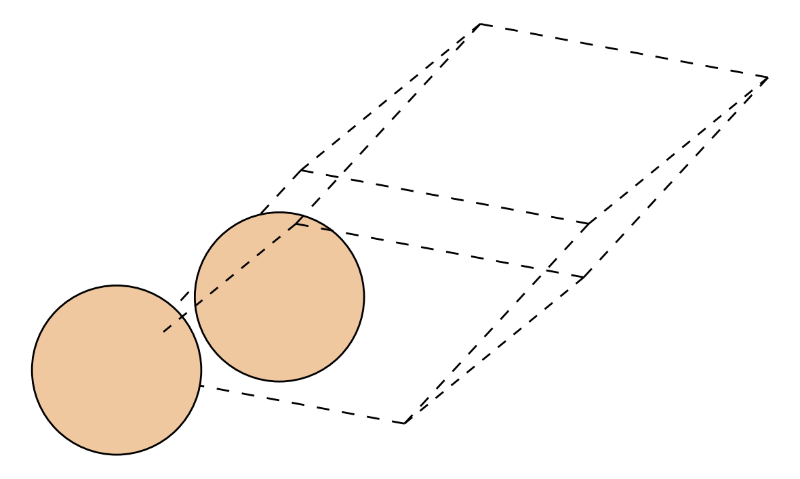
  <span style="font-size: 2rem; margin: 0 15px; vertical-align: middle;">➔</span>
  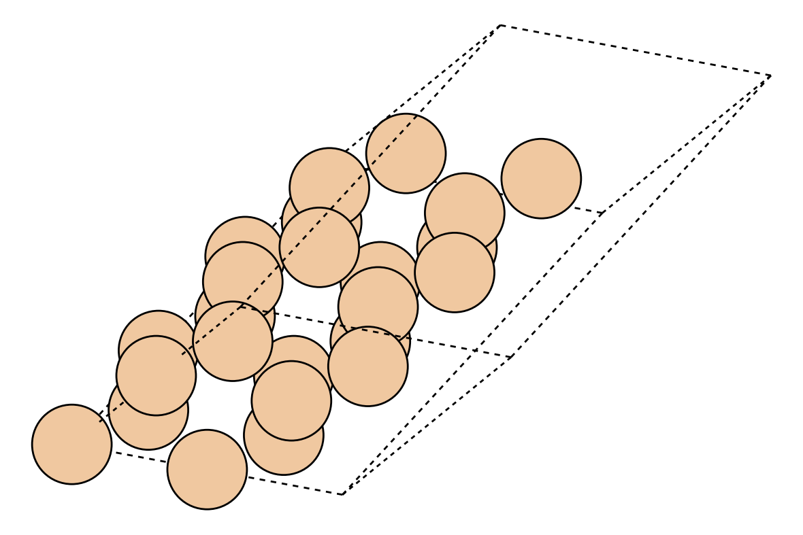
</p>

### 2. Convert primitive cell to conventional and scale to 2x2x2
```bash
cellify -i Si_primitive.POSCAR -o Si_conventional_222.POSCAR --conventional --dim 2 2 2
```

<p align="center">
  
  <span style="font-size: 2rem; margin: 0 15px; vertical-align: middle;">➔</span>
  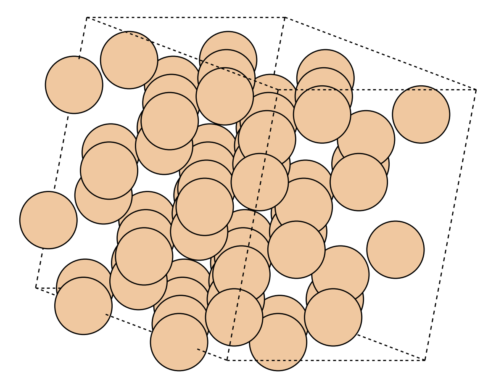
</p>

### 3. Orthogonalize a hexagonal cell (Quantum ESPRESSO input)
```bash
# Preserves &CONTROL and &SYSTEM settings, and updates nat, CELL_PARAMETERS, and ATOMIC_POSITIONS
cellify -i qe.in -o qe_ortho.in --matrix "1 -1 0 / 1 1 0 / 0 0 1"
```

<p align="center">
  
  <span style="font-size: 2rem; margin: 0 15px; vertical-align: middle;">➔</span>
  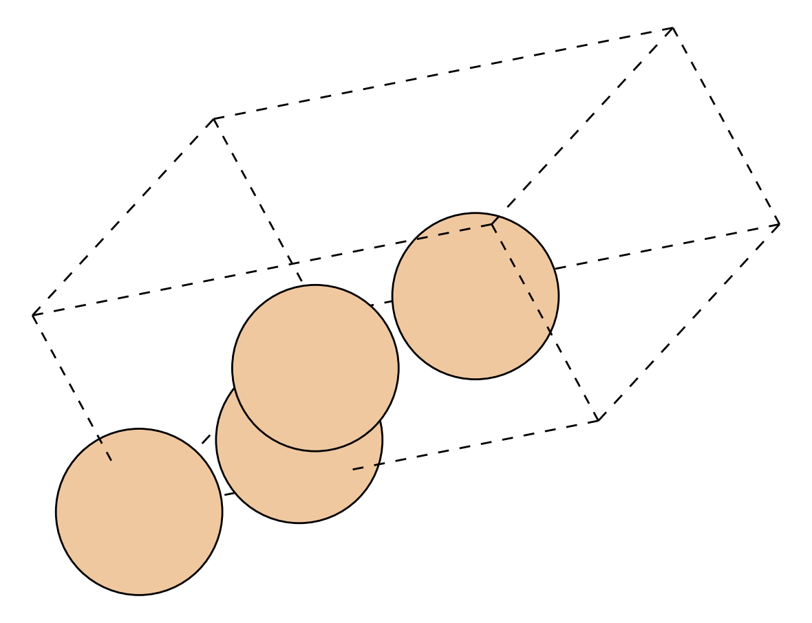
</p>

### 4. Generate the smallest supercell keeping defect distance $\ge 15\ \text{Å}$
```bash
cellify -i POSCAR -o POSCAR_defect_bulk --min-dist 15.0
```

<p align="center">
  
  <span style="font-size: 2rem; margin: 0 15px; vertical-align: middle;">➔</span>
  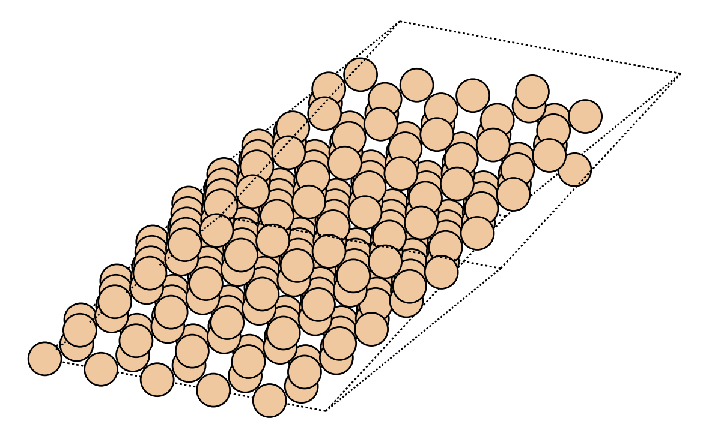
</p>

### 5. Create a silicon supercell and replace 1 atom with Phosphorus (n-type doped model)
```bash
cellify -i Si_unit.cif -o Si_doped.POSCAR --dim 3 3 3 --substitute "Si:P:0"
```

<p align="center">
  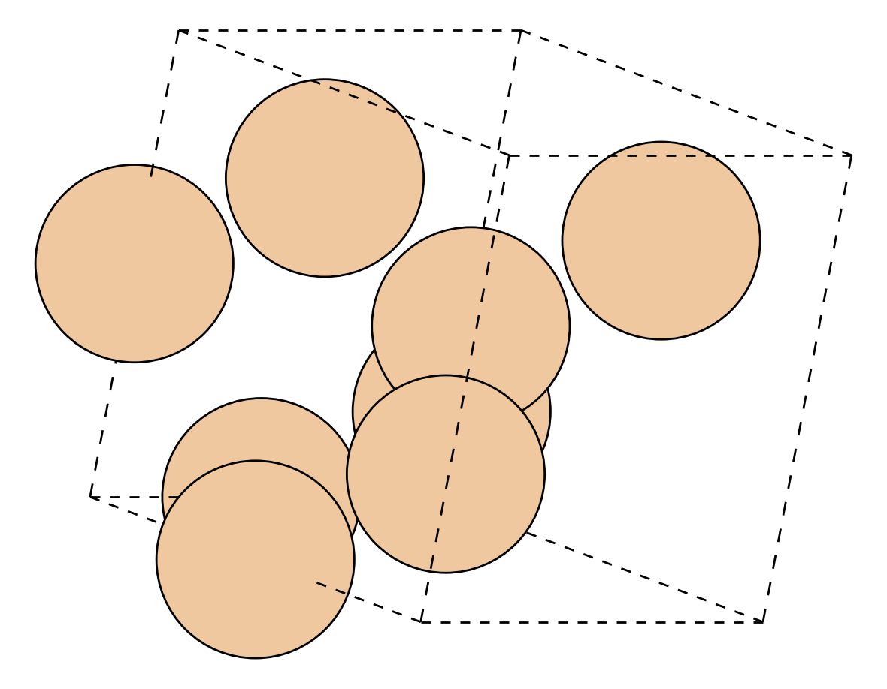
  <span style="font-size: 2rem; margin: 0 15px; vertical-align: middle;">➔</span>
  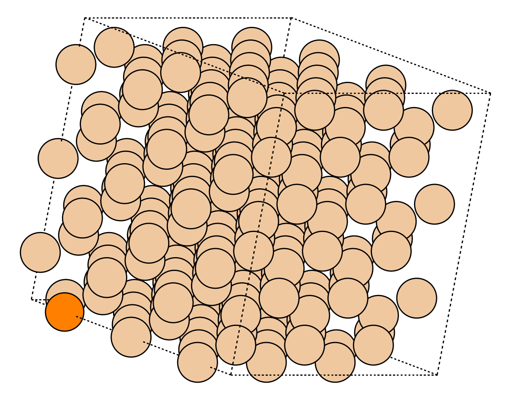
</p>

### 6. Introduce vacancies in a supercell (e.g., delete a specific Silicon atom, or randomly remove 2 Oxygen atoms)
```bash
# Deletes the Silicon atom at absolute index 0
cellify -i Si_supercell.POSCAR -o Si_vacancy.POSCAR --vacancy-index "Si:0"

# Randomly removes 2 Oxygen atoms from the structure
cellify -i STO_supercell.POSCAR -o STO_vacancies.POSCAR --vacancy-count "O:2"
```

<p align="center">
  
  <span style="font-size: 2rem; margin: 0 15px; vertical-align: middle;">➔</span>
  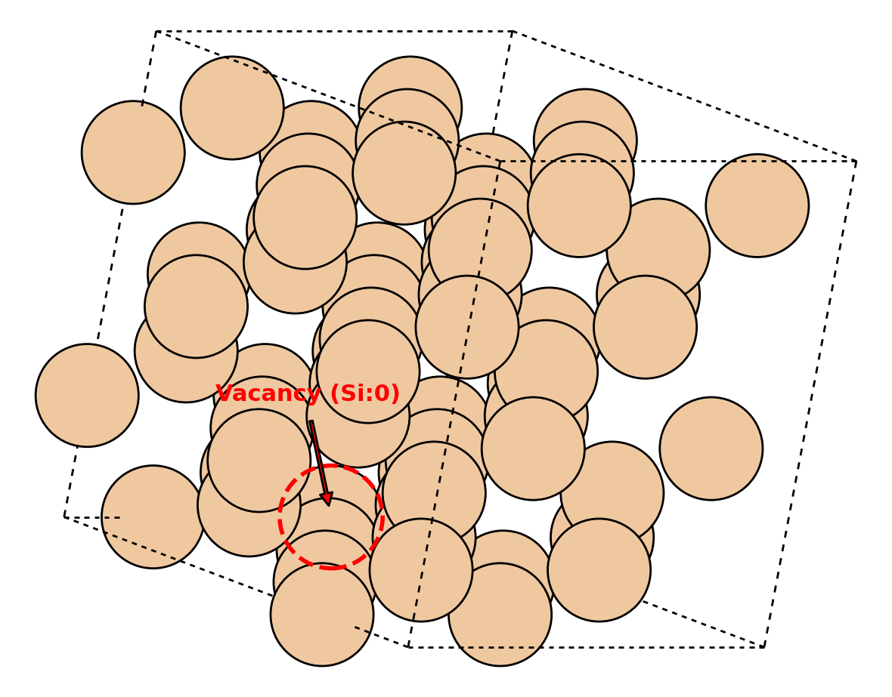
</p>

### 7. Generate a $\text{SrTiO}_3$ (100) surface slab model with $15\ \text{Å}$ vacuum
```bash
cellify -i STO_bulk.cif -o STO_100_slab.POSCAR --slab 1 0 0 --thick 12.0 --vacuum 15.0
```

<p align="center">
  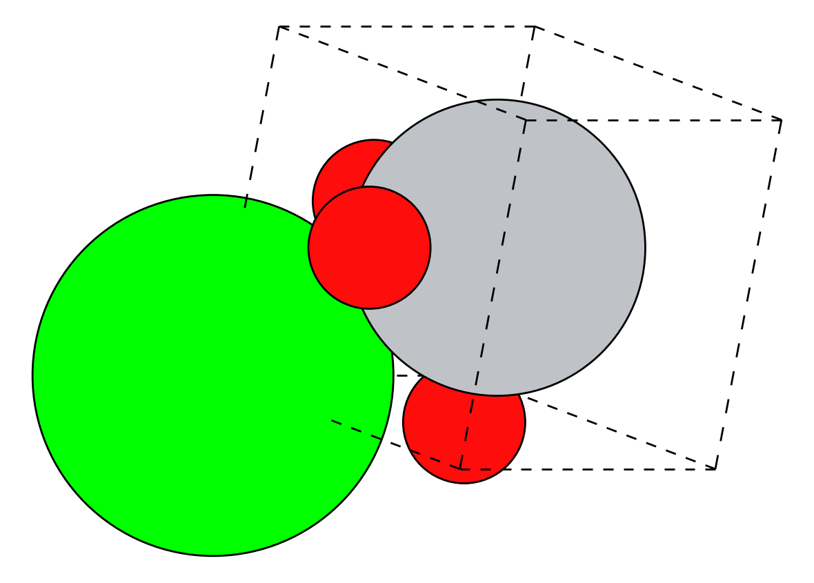
  <span style="font-size: 2rem; margin: 0 25px; vertical-align: middle;">➔</span>
  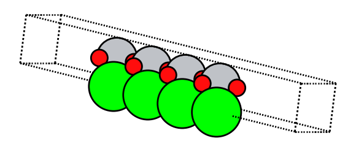
</p>

### 8. Extract relaxed structure from a Quantum ESPRESSO output log and generate an SCF input
```bash
# Reads the final relaxed structure from vc-relax.out,
# merges it with the computational settings in template.in,
# and writes scf.in with calculation = 'scf' and updated atom/type counts.
cellify -i vc-relax.out --template template.in -o scf.in --calc scf
```

<p align="center">
  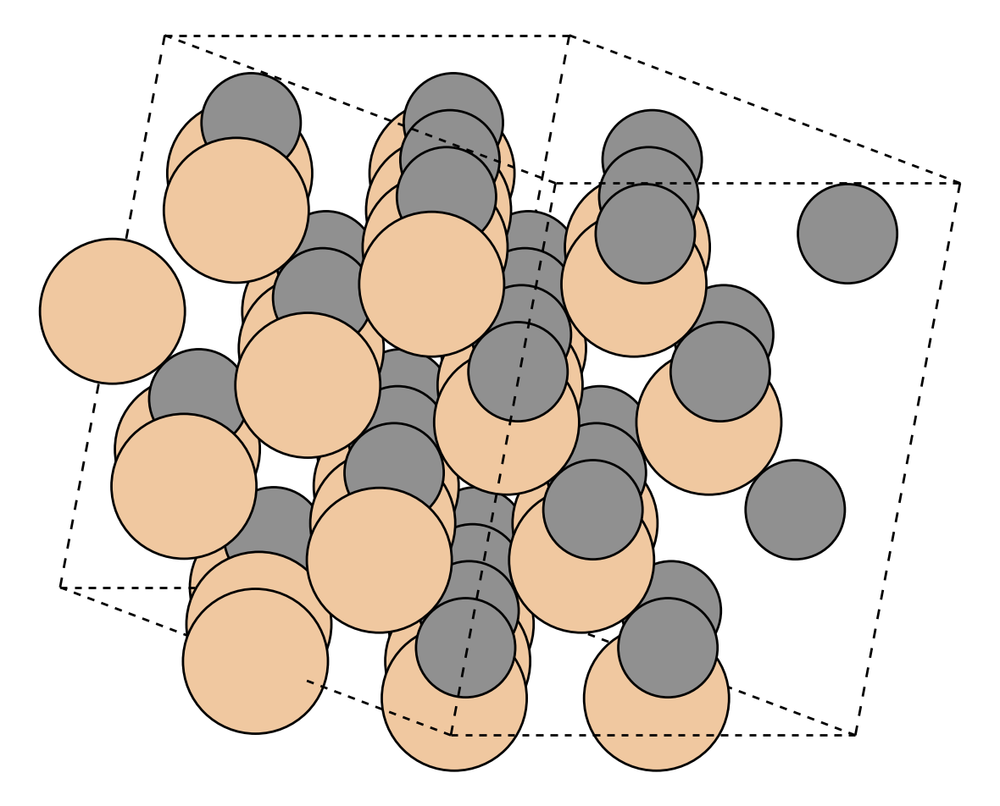
  <span style="font-size: 2rem; margin: 0 15px; vertical-align: middle;">➔</span>
  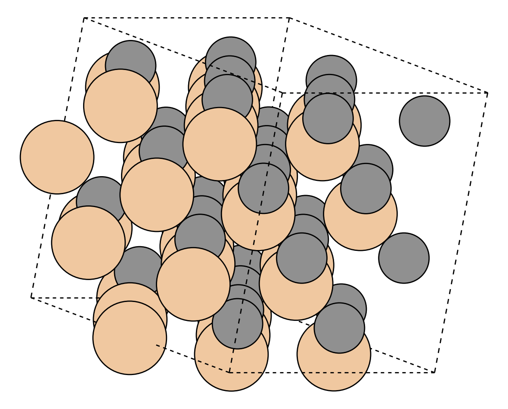
</p>

For more hands-on examples, check out the `examples/` directory.

---

## Directory Structure

```text
cellify/
├── pyproject.toml
├── README.md
├── examples/         # Runnable use cases for VASP and Quantum ESPRESSO
└── src/
    └── cellify/
        ├── __init__.py
        ├── cli.py            # CLI parser & execution flow
        ├── core.py           # Core structure modeling logic
        └── adapters/         # Formats and parameter preservation
            ├── __init__.py
            ├── base.py       # Base adapter interface
            ├── espresso.py   # Quantum ESPRESSO adapter
            └── standard.py   # Standard pymatgen/ASE adapter
```
